```mermaid
%%{init: {'theme': 'base', 'themeVariables': { 'primaryColor': '#2d6a4f', 'primaryTextColor': '#fff', 'primaryBorderColor': '#1a472a', 'lineColor': '#40916c'}}}%%
graph TB
    subgraph Serial["📡 Serial I/O"]
        PORT[port.gleam<br/>Auto-detect + Erlang Port]
        PARSE[parser.gleam<br/>CSV → Reading]
    end

    subgraph Signal["🧠 Signal Processing"]
        FEAT[features.gleam<br/>27 features]
        PROF[profile.gleam<br/>3 organism profiles]
        LEARN[learner.gleam<br/>HDC k-NN dynamic]
        DGPU[dynamic_gpu.gleam<br/>GPU + EMA learning]
        BRIDGE[label_bridge.gleam<br/>persistent_term FFI]
    end

    subgraph Web["🖥️ Web Layer"]
        SRV[server.gleam<br/>Mist HTTP + WS]
        PUB[pubsub.gleam<br/>OTP actor broadcast]
        DASH[dashboard.gleam<br/>Inline HTML/JS]
    end

    subgraph Core["⚙️ Core"]
        MAIN[vivino.gleam<br/>Main loop]
        FFI[vivino_ffi.erl<br/>Erlang FFI]
        DISP[display.gleam<br/>Terminal UI]
    end

    PORT --> PARSE --> MAIN
    MAIN --> FEAT --> LEARN & DGPU
    PROF --> LEARN & DGPU
    BRIDGE --> MAIN
    MAIN --> PUB --> SRV --> DASH
    MAIN --> DISP
    FFI --> PORT & BRIDGE
```

<div align="center">


[](https://gleam.run/)
[](https://www.erlang.org/)
[](./test)
[](./gleam.toml)
[](./LICENSE)

**Real-time plant bioelectric intelligence on the BEAM**

</div>

---

> [!IMPORTANT]
> **VIVINO is not a datalogger.**
> It's a real-time bioelectric intelligence system.
> Two AI classifiers (HDC hyperdimensional + GPU euclidean) learn
> the electrical language of each organism — mushrooms, cannabis, fungi.
> If you label, it learns. If you switch species, it adapts.

---

## Architecture

```mermaid
%%{init: {'theme': 'base', 'themeVariables': { 'primaryColor': '#2d6a4f', 'primaryTextColor': '#fff', 'primaryBorderColor': '#1a472a', 'lineColor': '#40916c'}}}%%
flowchart LR
    subgraph HW["🔌 Hardware"]
        ARD[Arduino<br/>AD620 + 14-bit ADC]
    end

    subgraph VIVINO["🧠 VIVINO"]
        direction TB
        PARSE[📡 Serial Parser<br/>Erlang Port FFI]
        FEAT[📊 27 Features<br/>Time + Hjorth + MFCC + Spectral]
        GPU[⚡ GPU Classifier<br/>Euclidean + Softmax]
        HDC[🧬 HDC Learner<br/>10,048-dim k-NN]
        PARSE --> FEAT
        FEAT --> GPU
        FEAT --> HDC
    end

    subgraph OUT["🖥️ Output"]
        DASH[Dashboard<br/>WebSocket]
        TERM[Terminal<br/>Live stats]
    end

    HW -->|"115200 baud"| VIVINO
    VIVINO -->|JSON| OUT
```



| Property | Value |
|:---------|:------|
| **Language** | Pure Gleam (type-safe functional) |
| **Runtime** | BEAM/OTP 28+ |
| **Tests** | 45 passing |
| **Features** | 27 dimensions per window |
| **HDC** | 10,048-dim hypervectors, online k-NN |
| **GPU** | Euclidean distance, softmax T=0.08 |
| **Organisms** | Shimeji, Cannabis sativa, Generic fungal |
| **Sampling** | 20 Hz, 2.5s sliding window |

---

## Quick Start

```bash
git clone https://github.com/gabrielmaialva33/vivino.git && cd vivino
gleam deps download
gleam build && gleam test
gleam run                                    # auto-detects Arduino
VIVINO_ORGANISM=cannabis gleam run           # Cannabis sativa profile
VIVINO_ORGANISM=fungal_generic gleam run     # generic fungal
```

Dashboard at **http://localhost:3000**

<details>
<summary><strong>Prerequisites</strong></summary>

| Tool | Version |
|:-----|:--------|
| Gleam | `>= 1.14.0` |
| Erlang/OTP | `>= 28` |
| [viva_tensor](https://github.com/gabrielmaialva33/viva_tensor) | local path dep |
| Arduino | AD620 + 14-bit ADC (256x oversampling) |

</details>

---

## Multi-Organism Profiles

```mermaid
%%{init: {'theme': 'base', 'themeVariables': { 'primaryColor': '#2d6a4f', 'primaryTextColor': '#fff'}}}%%
graph LR
    P[Profile] --> S["🍄 Shimeji<br/>H. tessellatus<br/>σ ~5mV quiet"]
    P --> C["🌿 Cannabis<br/>C. sativa<br/>50-150mV APs"]
    P --> F["🦠 Generic Fungal<br/>Wide ranges<br/>σ ~8mV quiet"]
```



| Feature | Shimeji | Cannabis | Generic Fungal |
|:--------|:-------:|:--------:|:--------------:|
| Mean range | [-50, 50] mV | [-200, 200] mV | [-100, 100] mV |
| Std range | [0, 50] | [0, 150] | [0, 80] |
| Signal range | [0, 200] | [0, 600] | [0, 400] |
| Energy range | [0, 150k] | [0, 2M] | [0, 500k] |
| Resting σ max | 3 mV | 10 mV | 5 mV |

---

## Dual AI Classification

Two independent classifiers, both with **online learning**:


### 6 Plant States

| State | Description |
|:------|:------------|
| **RESTING** | Electrical silence, low σ |
| **CALM** | Slow oscillations |
| **ACTIVE** | Spike trains, high variability |
| **TRANSITION** | Propagating signal, strong slope |
| **STIMULUS** | Fast response, high dV/dt |
| **STRESS** | Sustained amplitude, chaotic |

---

## Module Architecture



<details>
<summary><strong>27 Extracted Features</strong></summary>

| Group | Features | Count |
|:------|:---------|:-----:|
| **Time-domain** | mean, std, min, max, range, slope, energy, rms, dvdt_max, peak_freq, snr | 11 |
| **Hjorth** | activity, mobility, complexity | 3 |
| **MFCC** | 8 coefficients via Goertzel DFT | 8 |
| **Spectral** | entropy, centroid, rolloff, flatness, crest | 5 |

</details>

---

## Dashboard

Real-time dashboard at **http://localhost:3000**:

- Signal graph (mV) with auto-scroll
- GPU + HDC similarity bars side by side
- 27 extracted features
- Label buttons (6 states) for online learning
- Organism selector (Shimeji / Cannabis / Fungal)
- Learning stats (calibration + exemplars per state)
- Arduino stimulus controls (H/F/E/S/X)

**WebSocket Protocol:**

| Command | Direction | Description |
|:--------|:----------|:------------|
| `L:RESTING` | Client → Server | Label current state |
| `O:cannabis` | Client → Server | Switch organism |
| `H` / `F` / `E` / `S` / `X` | Client → Arduino | Stimulation commands |
| JSON broadcast | Server → Client | Data + classification per sample |

---

## Build

```bash
gleam build               # compile (zero warnings)
gleam test                # 45 tests
gleam format src test     # auto-format
gleam format --check      # CI check
```

---

## Documentation

| Language | Link |
|:--------:|:----:|
| English | [docs/en/](docs/en/) |
| Português | [docs/pt-br/](docs/pt-br/) |
| 中文 | [docs/zh-cn/](docs/zh-cn/) |

---

## VIVA Ecosystem

| Project | Description |
|:--------|:------------|
| [**viva**](https://github.com/gabrielmaialva33/viva) | Sentient digital life in Gleam |
| [**viva_tensor**](https://github.com/gabrielmaialva33/viva_tensor) | High-performance tensors for BEAM |
| [**viva_emotion**](https://github.com/gabrielmaialva33/viva_emotion) | Type-safe emotional core (PAD + O-U) |
| **vivino** | Plant bioelectric intelligence |

---

<div align="center">


*Built with 🍄 and Gleam by [@gabrielmaialva33](https://github.com/gabrielmaialva33)*

</div>
