```mermaid
%%{init: {'theme': 'base', 'themeVariables': { 'primaryColor': '#2d6a4f', 'primaryTextColor': '#fff', 'primaryBorderColor': '#1a472a', 'lineColor': '#40916c'}}}%%
flowchart LR
    subgraph HW["🔌 Hardware"]
        ARD[Arduino<br/>AD620 + 14-bit ADC]
    end

    subgraph VIVINO["🧠 VIVINO"]
        direction TB
        PARSE[📡 Serial Parser<br/>Erlang Port FFI]
        FEAT[📊 27 Features<br/>Time + Hjorth + MFCC + Spectral]
        GPU[⚡ GPU Classifier<br/>Euclidean + Softmax]
        HDC[🧬 HDC Learner<br/>10,048-dim k-NN]
        PARSE --> FEAT
        FEAT --> GPU
        FEAT --> HDC
    end

    subgraph OUT["🖥️ Output"]
        DASH[Dashboard<br/>WebSocket]
        TERM[Terminal<br/>Live stats]
    end

    HW -->|"115200 baud"| VIVINO
    VIVINO -->|JSON| OUT
```

<div align="center">


[](https://gleam.run/)
[](https://www.erlang.org/)
[](./test)
[](./gleam.toml)
[](./LICENSE)

---

*"Plantas nao falam. Mas se voce escutar com a resolucao certa, elas cantam."*

</div>

---

> [!IMPORTANT]
> **VIVINO nao e um datalogger.**
> E um sistema de inteligencia bioeletrica em tempo real.
> Dois classificadores AI (HDC hiperdimensional + GPU euclidiano) aprendem
> a linguagem eletrica de cada organismo — cogumelos, maconha, fungos.
> Se voce rotular, ele aprende. Se voce trocar de especie, ele se adapta.

---

## Overview



| Propriedade | Valor |
|:------------|:------|
| **Linguagem** | Pure Gleam (type-safe functional) |
| **Runtime** | BEAM/OTP 28+ |
| **Testes** | 45 passando |
| **Features** | 27 dimensoes por janela |
| **HDC** | 10,048-dim hypervectors, k-NN online |
| **GPU** | Euclidean distance, softmax T=0.08 |
| **Organismos** | Shimeji, Cannabis sativa, Fungo generico |
| **Amostragem** | 20 Hz, janela deslizante 2.5s |

---

## Quick Start

```bash
git clone https://github.com/gabrielmaialva33/vivino.git && cd vivino
gleam deps download
gleam build && gleam test
gleam run                                    # auto-detecta Arduino
VIVINO_ORGANISM=cannabis gleam run           # perfil Cannabis sativa
VIVINO_ORGANISM=fungal_generic gleam run     # fungo generico
```

Dashboard em **http://localhost:3000**

<details>
<summary><strong>Prerequisitos</strong></summary>

| Ferramenta | Versao |
|:-----------|:-------|
| Gleam | `>= 1.14.0` |
| Erlang/OTP | `>= 28` |
| [viva_tensor](https://github.com/gabrielmaialva33/viva_tensor) | local path dep |
| Arduino | AD620 + ADC 14-bit (256x oversampling) |

</details>

---

## Organismos Suportados

Cada especie tem perfil calibrado: ranges de quantizacao, prototipos GPU (19-dim x 6 estados), limiares de classificacao, e temperatura softmax.

```mermaid
%%{init: {'theme': 'base', 'themeVariables': { 'primaryColor': '#2d6a4f', 'primaryTextColor': '#fff'}}}%%
graph LR
    P[Profile] --> S["🍄 Shimeji<br/>H. tessellatus<br/>σ ~5mV quiet"]
    P --> C["🌿 Cannabis<br/>C. sativa<br/>50-150mV APs"]
    P --> F["🦠 Fungo Gen.<br/>Wide ranges<br/>σ ~8mV quiet"]
```



| Feature | Shimeji | Cannabis | Fungo Gen. |
|:--------|:-------:|:--------:|:----------:|
| Mean range | [-50, 50] mV | [-200, 200] mV | [-100, 100] mV |
| Std range | [0, 50] | [0, 150] | [0, 80] |
| Signal range | [0, 200] | [0, 600] | [0, 400] |
| Energy range | [0, 150k] | [0, 2M] | [0, 500k] |
| Resting σ max | 3 mV | 10 mV | 5 mV |
| Spike dV/dt min | 500 | 1500 | 800 |

---

## Classificacao Dual AI

Dois classificadores independentes, ambos com **online learning**:

### HDC Learner (Hyperdimensional Computing)

```
Signal Features → Quantize → Role-Bind → Superpose → 10,048-dim HV
                                                          ↓
                                              k-NN vs exemplars + prototypes
                                                          ↓
                                              6 estados + similarity scores
```

- **k-NN hiperdimensional**: armazena ultimos 5 exemplares por estado (ring buffer)
- **Prototipos iniciais**: peso 0.3x, exemplares peso 1.0x
- **Auto-calibracao**: primeiras 60 amostras (3s) → RESTING automatico
- **Online learning**: rotule pelo dashboard, aprende instantaneo

### GPU Classifier (Euclidean Distance)

- **19 features normalizadas** por bounds do perfil
- **6 prototipos** calibrados por especie
- **Softmax** com temperatura 0.08
- **EMA learning**: alpha=0.1, atualiza prototipos quando rotulado

### 6 Estados

| Estado | Descricao |
|:-------|:----------|
| **RESTING** | Silencio eletrico, σ baixo |
| **CALM** | Oscilacoes lentas |
| **ACTIVE** | Spike trains, alta variabilidade |
| **TRANSITION** | Sinal propagante, slope forte |
| **STIMULUS** | Resposta rapida, alto dV/dt |
| **STRESS** | Amplitude sustentada, caotico |

---

## Arquitetura

```mermaid
%%{init: {'theme': 'base', 'themeVariables': { 'primaryColor': '#2d6a4f', 'primaryTextColor': '#fff', 'primaryBorderColor': '#1a472a', 'lineColor': '#40916c'}}}%%
graph TB
    subgraph Serial["📡 Serial I/O"]
        PORT[port.gleam<br/>Auto-detect + Erlang Port]
        PARSE[parser.gleam<br/>CSV → Reading]
    end

    subgraph Signal["🧠 Signal Processing"]
        FEAT[features.gleam<br/>27 features]
        PROF[profile.gleam<br/>3 organism profiles]
        LEARN[learner.gleam<br/>HDC k-NN dynamic]
        DGPU[dynamic_gpu.gleam<br/>GPU + EMA learning]
        BRIDGE[label_bridge.gleam<br/>persistent_term FFI]
    end

    subgraph Web["🖥️ Web Layer"]
        SRV[server.gleam<br/>Mist HTTP + WS]
        PUB[pubsub.gleam<br/>OTP actor broadcast]
        DASH[dashboard.gleam<br/>Inline HTML/JS]
    end

    subgraph Core["⚙️ Core"]
        MAIN[vivino.gleam<br/>Main loop]
        FFI[vivino_ffi.erl<br/>Erlang FFI]
        DISP[display.gleam<br/>Terminal UI]
    end

    PORT --> PARSE --> MAIN
    MAIN --> FEAT --> LEARN & DGPU
    PROF --> LEARN & DGPU
    BRIDGE --> MAIN
    MAIN --> PUB --> SRV --> DASH
    MAIN --> DISP
    FFI --> PORT & BRIDGE
```



<details>
<summary><strong>27 Features Extraidas</strong></summary>

| Grupo | Features | Count |
|:------|:---------|:-----:|
| **Time-domain** | mean, std, min, max, range, slope, energy, rms, dvdt_max, peak_freq, snr | 11 |
| **Hjorth** | activity, mobility, complexity | 3 |
| **MFCC** | 8 coeficientes via Goertzel DFT | 8 |
| **Spectral** | entropy, centroid, rolloff, flatness, crest | 5 |

</details>

<details>
<summary><strong>Formato Serial Arduino</strong></summary>

CSV a 20 Hz:
```
elapsed_ms,raw_adc,millivolts,deviation
1523,8192,500.0,0.5
1573,8205,504.0,4.5
...
```

- ADC 14-bit com 256x oversampling
- Resolucao: 0.305 mV/LSB
- Amplificador: AD620 instrumentation amp

</details>

---

## Dashboard

O dashboard em **http://localhost:3000** mostra em tempo real:

- Grafico de sinal (mV) com scroll automatico
- Barras de similaridade GPU + HDC lado a lado
- 27 features extraidas
- Botoes de rotulacao (6 estados) para online learning
- Seletor de organismo (Shimeji / Cannabis / Fungo)
- Stats de aprendizado (calibracao + exemplares por estado)
- Controles Arduino (H/F/E/S/X)

**Protocolo WebSocket:**

| Comando | Direcao | Descricao |
|:--------|:--------|:----------|
| `L:RESTING` | Client → Server | Rotular estado atual |
| `O:cannabis` | Client → Server | Trocar organismo |
| `H` / `F` / `E` / `S` / `X` | Client → Arduino | Comandos de estimulacao |
| JSON broadcast | Server → Client | Dados + classificacao a cada amostra |

---

## Desenvolvimento

```bash
gleam build               # compilar (zero warnings)
gleam test                # 45 testes
gleam format src test     # auto-format
gleam format --check      # CI check
```

```bash
# Pipe mode (sem Arduino)
echo "1000,8192,500.0,0.5" | gleam run

# Debug serial
stty -F /dev/ttyUSB0 115200 raw -echo -hupcl
cat /dev/ttyUSB0
```

---

## Ecossistema VIVA

Vivino faz parte do ecossistema [VIVA](https://github.com/gabrielmaialva33/viva):

| Projeto | Descricao |
|:--------|:----------|
| [**viva**](https://github.com/gabrielmaialva33/viva) | Vida digital senciente em Gleam |
| [**viva_tensor**](https://github.com/gabrielmaialva33/viva_tensor) | Tensores high-performance para BEAM |
| [**viva_emotion**](https://github.com/gabrielmaialva33/viva_emotion) | Core emocional type-safe (PAD + O-U) |
| **vivino** | Inteligencia bioeletrica de plantas |

---

<div align="center">


*Feito com 🍄 e Gleam por [@gabrielmaialva33](https://github.com/gabrielmaialva33)*

</div>
