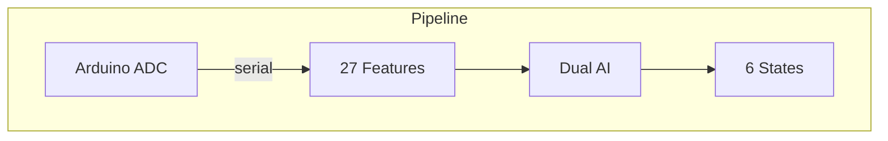

# vivino

**[Português](../pt-br/README.md)**



## Concept

Real-time bioelectric signal processor for plant organisms. Reads 14-bit ADC data from Arduino + AD620 instrumentation amplifier, extracts 27 signal features, classifies with two independent AI classifiers (HDC + GPU), and streams live to a web dashboard via WebSocket.

Supports multiple organisms with calibrated profiles. Online learning from user labels.

## Quick Start

```bash
gleam deps download
gleam run                                # auto-detects Arduino serial port
VIVINO_ORGANISM=cannabis gleam run       # Cannabis sativa profile
```

Dashboard at `http://localhost:3000`

## Signal Features (27 dimensions)

| Group | Features | Count |
|:------|:---------|:-----:|
| **Time-domain** | mean, std, min, max, range, slope, energy, rms, dvdt_max, peak_freq, snr | 11 |
| **Hjorth** | activity, mobility, complexity | 3 |
| **MFCC** | 8 coefficients via Goertzel DFT | 8 |
| **Spectral** | entropy, centroid, rolloff, flatness, crest | 5 |

Extracted from a sliding window of 50 samples (2.5s @ 20 Hz).

## Classifiers

### HDC Learner (Hyperdimensional Computing)

10,048-dimensional binary hypervectors with role-binding encoding.

- **k-NN classification**: compares query HV against stored exemplars + initial prototypes
- **Ring buffer**: stores last 5 labeled exemplars per state (30 total)
- **Prototype weighting**: initial prototypes 0.3×, exemplars 1.0×
- **Auto-calibration**: first 60 samples (3s) automatically labeled as RESTING

### GPU Classifier (Euclidean Distance)

19-feature normalized euclidean distance with softmax (T=0.08).

- **6 prototype vectors** per organism, calibrated from literature/measurements
- **EMA online learning**: alpha=0.1 updates prototypes when user labels a state
- **Profile-parametrized**: normalization bounds from organism profile

### Plant States

| State | Indicators |
|:------|:-----------|
| RESTING | σ < threshold, low range |
| CALM | moderate σ, slow oscillations |
| ACTIVE | high σ, spike trains |
| TRANSITION | strong slope, propagating signal |
| STIMULUS | high dV/dt, sharp peak |
| STRESS | sustained high amplitude, chaotic |

## Organism Profiles

Each profile defines: quantization ranges (HDC), normalization bounds (GPU), 6 prototype vectors (19-dim), classification thresholds, softmax temperature.

| Parameter | Shimeji | Cannabis | Generic Fungal |
|:----------|:-------:|:--------:|:--------------:|
| Mean | [-50, 50] | [-200, 200] | [-100, 100] |
| Std | [0, 50] | [0, 150] | [0, 80] |
| Range | [0, 200] | [0, 600] | [0, 400] |
| Slope | [-30, 30] | [-100, 100] | [-50, 50] |
| Energy | [0, 150k] | [0, 2M] | [0, 500k] |

Set via environment variable: `VIVINO_ORGANISM=cannabis`

## WebSocket Protocol

| Message | Direction | Format |
|:--------|:----------|:-------|
| Data broadcast | Server → Client | Full JSON with readings, features, classifications |
| `L:STATE` | Client → Server | Label current state (e.g., `L:RESTING`) |
| `O:organism` | Client → Server | Switch organism (e.g., `O:cannabis`) |
| `H`/`F`/`E`/`S`/`X` | Client → Arduino | Stimulation commands |
| `label_ack` | Server → Client | Label confirmation |
| `organism_ack` | Server → Client | Organism switch confirmation |

## Serial Format

CSV at 20 Hz from Arduino:
```
elapsed_ms,raw_adc,millivolts,deviation
1523,8192,500.0,0.5
```

- 14-bit ADC with 256× oversampling
- Resolution: 0.305 mV/LSB
- Amplifier: AD620 instrumentation amp
- Baud: 115200, raw mode, no DTR reset

## Build & Test

```bash
gleam build               # compile (zero warnings expected)
gleam test                # 45 tests
gleam format --check      # formatting check
```

## Dependencies

- [Gleam](https://gleam.run) >= 1.14.0
- Erlang/OTP >= 28
- [viva_tensor](https://github.com/gabrielmaialva33/viva_tensor) (local path dependency)
