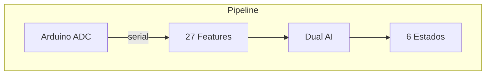

# vivino

**[English](../en/README.md)** | **[中文](../zh-cn/README.md)**



## Conceito

Processador de sinais bioeletricos de plantas em tempo real. Le dados ADC de 14 bits do Arduino + amplificador de instrumentacao AD620, extrai 27 features do sinal, classifica com dois classificadores AI independentes (HDC + GPU), e transmite ao vivo para um dashboard web via WebSocket.

Suporta multiplos organismos com perfis calibrados. Aprendizado online a partir de rotulos do usuario.

## Inicio Rapido

```bash
gleam deps download
gleam run                                # auto-detecta porta serial Arduino
VIVINO_ORGANISM=cannabis gleam run       # perfil Cannabis sativa
```

Dashboard em `http://localhost:3000`

## Features do Sinal (27 dimensoes)

| Grupo | Features | Qtd |
|:------|:---------|:---:|
| **Dominio temporal** | mean, std, min, max, range, slope, energy, rms, dvdt_max, peak_freq, snr | 11 |
| **Hjorth** | activity, mobility, complexity | 3 |
| **MFCC** | 8 coeficientes via Goertzel DFT | 8 |
| **Espectral** | entropy, centroid, rolloff, flatness, crest | 5 |

Extraidas de uma janela deslizante de 50 amostras (2.5s @ 20 Hz).

## Classificadores

### HDC Learner (Computacao Hiperdimensional)

Hipervetores binarios de 10.048 dimensoes com codificacao por role-binding.

- **Classificacao k-NN**: compara HV query contra exemplares armazenados + prototipos iniciais
- **Ring buffer**: armazena ultimos 5 exemplares rotulados por estado (30 total)
- **Peso dos prototipos**: prototipos iniciais 0.3×, exemplares 1.0×
- **Auto-calibracao**: primeiras 60 amostras (3s) automaticamente rotuladas como RESTING

### Classificador GPU (Distancia Euclidiana)

Distancia euclidiana normalizada de 19 features com softmax (T=0.08).

- **6 vetores prototipo** por organismo, calibrados a partir de literatura/medicoes
- **Aprendizado online EMA**: alpha=0.1 atualiza prototipos quando usuario rotula
- **Parametrizado por perfil**: bounds de normalizacao do perfil do organismo

### Estados da Planta

| Estado | Indicadores |
|:-------|:------------|
| RESTING | σ baixo, range pequeno |
| CALM | σ moderado, oscilacoes lentas |
| ACTIVE | σ alto, spike trains |
| TRANSITION | slope forte, sinal propagante |
| STIMULUS | dV/dt alto, pico agudo |
| STRESS | amplitude sustentada alta, caotico |

## Perfis de Organismos

Cada perfil define: ranges de quantizacao (HDC), bounds de normalizacao (GPU), 6 vetores prototipo (19-dim), limiares de classificacao, temperatura softmax.

| Parametro | Shimeji | Cannabis | Fungo Generico |
|:----------|:-------:|:--------:|:--------------:|
| Mean | [-50, 50] | [-200, 200] | [-100, 100] |
| Std | [0, 50] | [0, 150] | [0, 80] |
| Range | [0, 200] | [0, 600] | [0, 400] |
| Slope | [-30, 30] | [-100, 100] | [-50, 50] |
| Energy | [0, 150k] | [0, 2M] | [0, 500k] |

Configurado via variavel de ambiente: `VIVINO_ORGANISM=cannabis`

## Protocolo WebSocket

| Mensagem | Direcao | Formato |
|:---------|:--------|:--------|
| Broadcast de dados | Servidor → Cliente | JSON completo com leituras, features, classificacoes |
| `L:ESTADO` | Cliente → Servidor | Rotular estado atual (ex: `L:RESTING`) |
| `O:organismo` | Cliente → Servidor | Trocar organismo (ex: `O:cannabis`) |
| `H`/`F`/`E`/`S`/`X` | Cliente → Arduino | Comandos de estimulacao |
| `label_ack` | Servidor → Cliente | Confirmacao de rotulo |
| `organism_ack` | Servidor → Cliente | Confirmacao de troca de organismo |

## Formato Serial

CSV a 20 Hz do Arduino:
```
elapsed_ms,raw_adc,millivolts,deviation
1523,8192,500.0,0.5
```

- ADC 14 bits com 256× oversampling
- Resolucao: 0.305 mV/LSB
- Amplificador: AD620 instrumentacao
- Baud: 115200, modo raw, sem reset DTR

## Build & Testes

```bash
gleam build               # compilar (zero warnings esperado)
gleam test                # 45 testes
gleam format --check      # check de formatacao
```

## Dependencias

- [Gleam](https://gleam.run) >= 1.14.0
- Erlang/OTP >= 28
- [viva_tensor](https://github.com/gabrielmaialva33/viva_tensor) (dependencia local por path)
