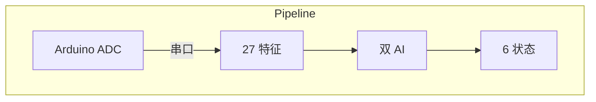

# vivino

**[English](../en/README.md)** | **[Português](../pt-br/README.md)**



## 概念

实时植物生物电信号处理器。从 Arduino + AD620 仪表放大器读取 14 位 ADC 数据，提取 27 个信号特征，使用两个独立的 AI 分类器（HDC + GPU）进行分类，并通过 WebSocket 实时传输到 Web 仪表盘。

支持多种生物体的校准配置文件。通过用户标签进行在线学习。

## 快速开始

```bash
gleam deps download
gleam run                                # 自动检测 Arduino 串口
VIVINO_ORGANISM=cannabis gleam run       # 大麻配置文件
```

仪表盘访问 `http://localhost:3000`

## 信号特征（27 维）

| 类别 | 特征 | 数量 |
|:-----|:-----|:----:|
| **时域** | mean, std, min, max, range, slope, energy, rms, dvdt_max, peak_freq, snr | 11 |
| **Hjorth** | activity, mobility, complexity | 3 |
| **MFCC** | 8 个系数（Goertzel DFT） | 8 |
| **频谱** | entropy, centroid, rolloff, flatness, crest | 5 |

从 50 个样本的滑动窗口中提取（20 Hz 采样，2.5 秒窗口）。

## 分类器

### HDC 学习器（超维计算）

10,048 维二进制超向量，角色绑定编码。

- **k-NN 分类**：将查询超向量与存储的样本 + 初始原型进行比较
- **环形缓冲区**：每种状态存储最近 5 个标记样本（共 30 个）
- **原型权重**：初始原型 0.3×，样本 1.0×
- **自动校准**：前 60 个样本（3 秒）自动标记为 RESTING

### GPU 分类器（欧氏距离）

19 维归一化欧氏距离 + softmax（T=0.08）。

- 每种生物体 **6 个原型向量**，基于文献/测量数据校准
- **EMA 在线学习**：alpha=0.1，用户标记时更新原型
- **配置文件参数化**：归一化边界来自生物体配置文件

### 植物状态

| 状态 | 指标 |
|:-----|:-----|
| RESTING | σ 低，范围小 |
| CALM | σ 适中，缓慢振荡 |
| ACTIVE | σ 高，尖峰序列 |
| TRANSITION | 斜率强，传播信号 |
| STIMULUS | dV/dt 高，尖锐峰值 |
| STRESS | 持续高幅度，混沌 |

## 生物体配置文件

每个配置文件定义：量化范围（HDC）、归一化边界（GPU）、6 个原型向量（19 维）、分类阈值、softmax 温度。

| 参数 | 白玉菇 | 大麻 | 通用真菌 |
|:-----|:------:|:----:|:--------:|
| Mean | [-50, 50] | [-200, 200] | [-100, 100] |
| Std | [0, 50] | [0, 150] | [0, 80] |
| Range | [0, 200] | [0, 600] | [0, 400] |
| Slope | [-30, 30] | [-100, 100] | [-50, 50] |
| Energy | [0, 150k] | [0, 2M] | [0, 500k] |

通过环境变量设置：`VIVINO_ORGANISM=cannabis`

## WebSocket 协议

| 消息 | 方向 | 格式 |
|:-----|:-----|:-----|
| 数据广播 | 服务器 → 客户端 | 完整 JSON（读数、特征、分类） |
| `L:STATE` | 客户端 → 服务器 | 标记当前状态（如 `L:RESTING`） |
| `O:organism` | 客户端 → 服务器 | 切换生物体（如 `O:cannabis`） |
| `H`/`F`/`E`/`S`/`X` | 客户端 → Arduino | 刺激命令 |
| `label_ack` | 服务器 → 客户端 | 标记确认 |
| `organism_ack` | 服务器 → 客户端 | 生物体切换确认 |

## 串口格式

Arduino 20 Hz CSV 输出：
```
elapsed_ms,raw_adc,millivolts,deviation
1523,8192,500.0,0.5
```

- 14 位 ADC，256× 过采样
- 分辨率：0.305 mV/LSB
- 放大器：AD620 仪表放大器
- 波特率：115200，raw 模式，无 DTR 复位

## 构建与测试

```bash
gleam build               # 编译（预期零警告）
gleam test                # 45 个测试
gleam format --check      # 格式检查
```

## 依赖

- [Gleam](https://gleam.run) >= 1.14.0
- Erlang/OTP >= 28
- [viva_tensor](https://github.com/gabrielmaialva33/viva_tensor)（本地路径依赖）
